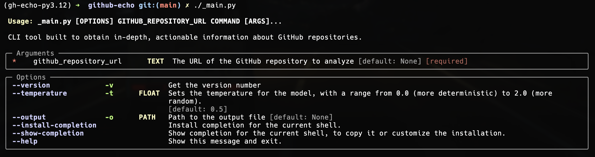
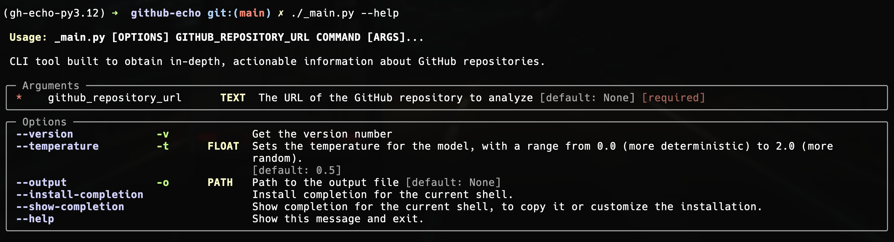
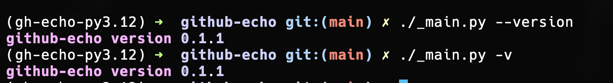
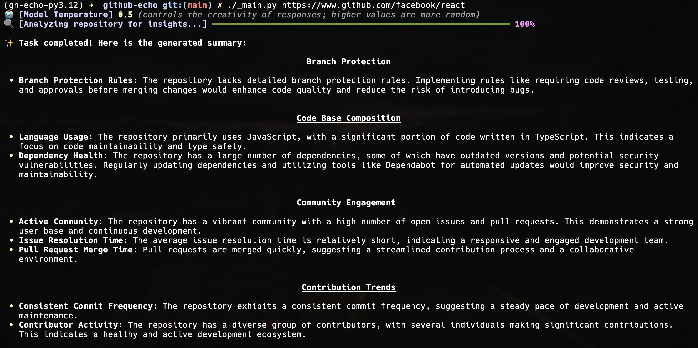
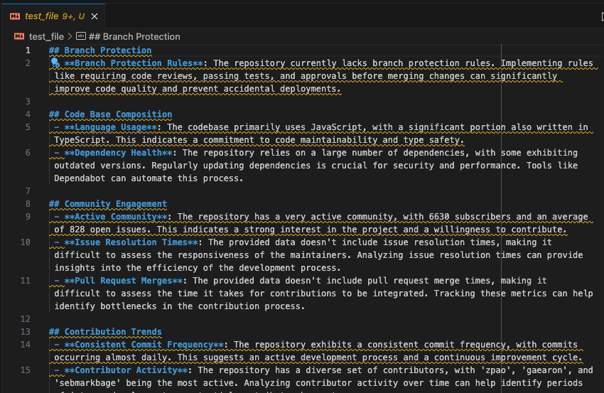
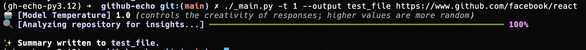

# Example Commands and Results

The following examples showcase how to use the `github-echo` tool. Each command demonstrates different options and outputs.

## Basic Command

```sh
./_main.py
```

This command runs the `github-echo` tool and expects a GitHub repository URL or file path as input. Without any arguments, it will display the **help menu**.



## Display Help

```sh
./_main.py --help
```

Use this command to display the **help menu**, listing all available options and flags for the tool.



### Show Version

```sh
./_main.py --version
# OR
./_main.py --versionv
```

This command outputs the **current version** of the `github-echo` tool.



### Analyze a GitHub Repository

```sh
./_main.py https://www.github.com/facebook/react
```

Analyze the specified GitHub repository (`facebook/react` in this case). The tool will provide an AI-generated explanation of the repository and output the results in `stdout`.



### Specify Output File

```sh
./_main.py --output test_file https://www.github.com/facebook/react
# OR
./_main.py -o test_file https://www.github.com/facebook/react
```

Generate an explanation for the `facebook/react` repository and save the output to `test_file` instead of printing it in the terminal. You can also specify a path here if you want instead of just the name of the file. This path could be `relative` or `absolute`.


Here is what the output file would look like.



### Custom Temperature Setting

```sh
./_main.py -temperature 1 --output test_file https://www.github.com/facebook/react
# OR
./_main.py -t 1 --output test_file https://www.github.com/facebook/react
```

Generate an explanation for the repository, but this time with a custom temperature value of `1`. This sets the AI to be less deterministic, producing more creative results. The lesser the temperature, the less creative the model will be. The output is saved in `test_file`.


