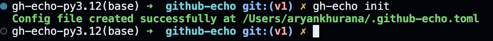
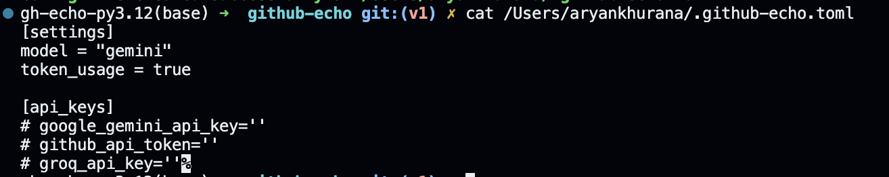
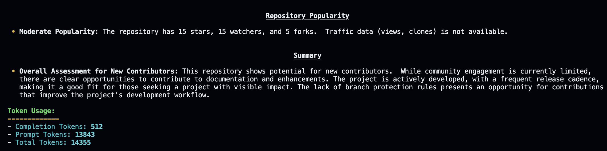

# Example Commands and Results

The following examples showcase how to use the `github-echo` tool. Each command demonstrates different options and outputs.

- [Getting Help](#getting-help)
  - [Default Help Menu](#default-help-menu)
  - [Detailed Help Menu](#detailed-help-menu)
  - [Help for a Specific Command](#help-for-a-specific-command)
- [Version Information](#version-information)
  - [Check the Version](#check-the-version)
- [Configuration Management](#configuration-management)
  - [Create a Configuration File](#create-a-configuration-file)
  - [Remove the Configuration File](#remove-the-configuration-file)
- [Analyzing GitHub Repositories](#analyzing-github-repositories)
  - [Analyze a Repository](#analyze-a-repository)
  - [Output to a File](#output-to-a-file)
- [Customizing Configurations](#customizing-configurations)
  - [Modifying Defaults in the Config File](#modifying-defaults-in-the-config-file)
  - [Disabling Token Usage Display](#disabling-token-usage-display)
- [Adjusting Parameters](#adjusting-parameters)
  - [Changing the Temperature](#changing-the-temperature)
  - [Selecting a Different Model](#selecting-a-different-model)
- [Author](#author)

## Getting Help

### Default Help Menu

Running the following command displays the help menu:

```bash
gh-echo
```


### Detailed Help Menu

To explicitly access the help menu, use:

```bash
gh-echo --help
```


### Help for a Specific Command

To view the help menu for a specific command, such as `analyze`, use:

```bash
gh-echo analyze --help
```


---

## Version Information

### Check the Version

Use one of the following commands to see the current version of the tool:

```bash
gh-echo --version
# OR
gh-echo -v
```


---

## Configuration Management

### Create a Configuration File

To generate a default configuration file:

```bash
gh-echo init
```



**The generated configuration file will look similar to this:**



### Remove the Configuration File

To delete the configuration file:

```bash
gh-echo remove-config
```


---

## Analyzing GitHub Repositories

### Analyze a Repository

To analyze a GitHub repository:

```bash
gh-echo analyze https://github.com/AryanK1511/github-echo
```

  


### Output to a File

To redirect the analysis output to a file:

```bash
gh-echo analyze https://github.com/AryanK1511/github-echo -o output.md
```


**The markdown output will look like this:**


---

## Customizing Configurations

### Modifying Defaults in the Config File

Adjust the settings in the configuration file as needed. For example:  


### Disabling Token Usage Display

**By modifying the configuration, you can disable token usage information in the output:**


Alternatively, enable it using the `--show-token-usage` flag:

```bash
gh-echo analyze https://github.com/AryanK1511/github-echo --show-token-usage
```

---

## Adjusting Parameters

### Changing the Temperature

Modify the model temperature for the analysis using:

```bash
gh-echo analyze https://github.com/AryanK1511/github-echo -o output.md -t 1
# OR
gh-echo analyze https://github.com/AryanK1511/github-echo -o output.md --model-temperature 1
```


### Selecting a Different Model

Specify a different model for analysis using:

```bash
gh-echo analyze https://github.com/AryanK1511/PiZone -o output.md -t 1 -m groq
# OR
gh-echo analyze https://github.com/AryanK1511/PiZone -o output.md -t 1 --model groq
```


## Author

[Aryan Khurana](github.com/AryanK1511)
